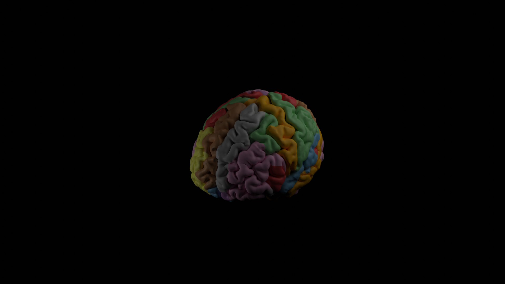
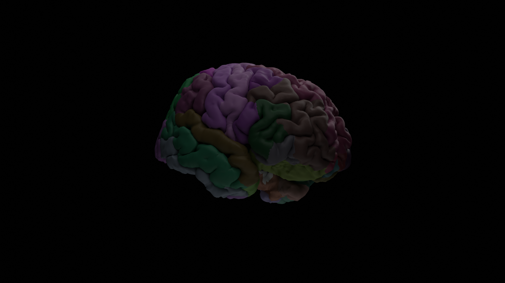
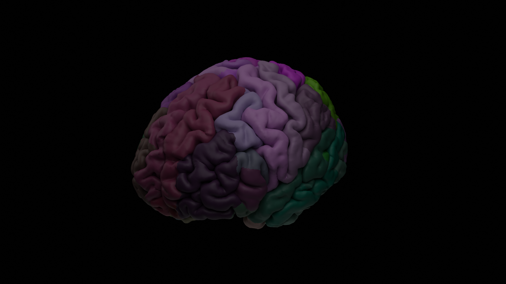

# Render brain atlases using Blender 
This repository contains the .blend file (`DKT_atlas.blend`) and python scripts to map data (`factors.csv`) to colours in in a pial brain representation in blender. Using a nice lighting setup with ray tracing leads to nice results!

## How to run
```bash
blender -b -Y DKT_atlas.blend -P scripts/execute.py
```

## Output


